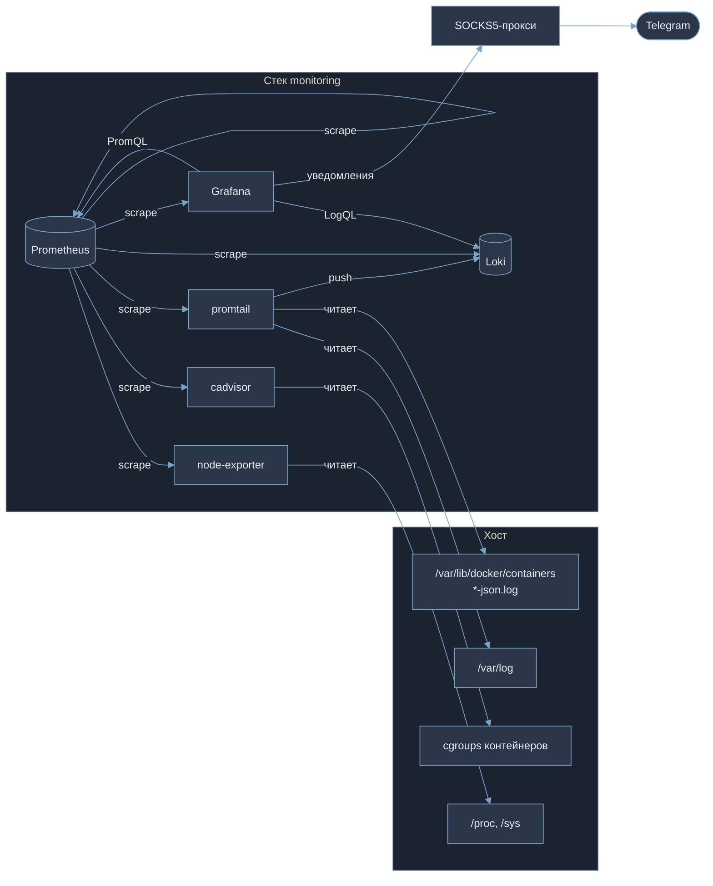
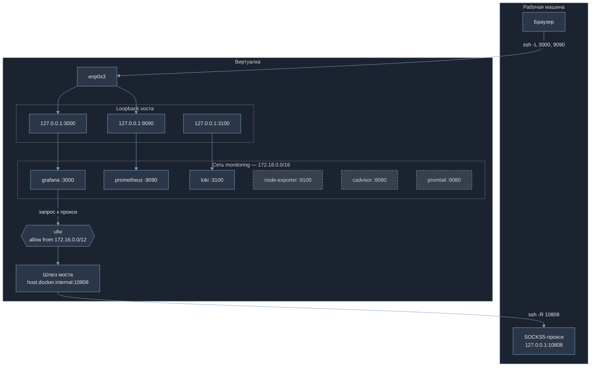
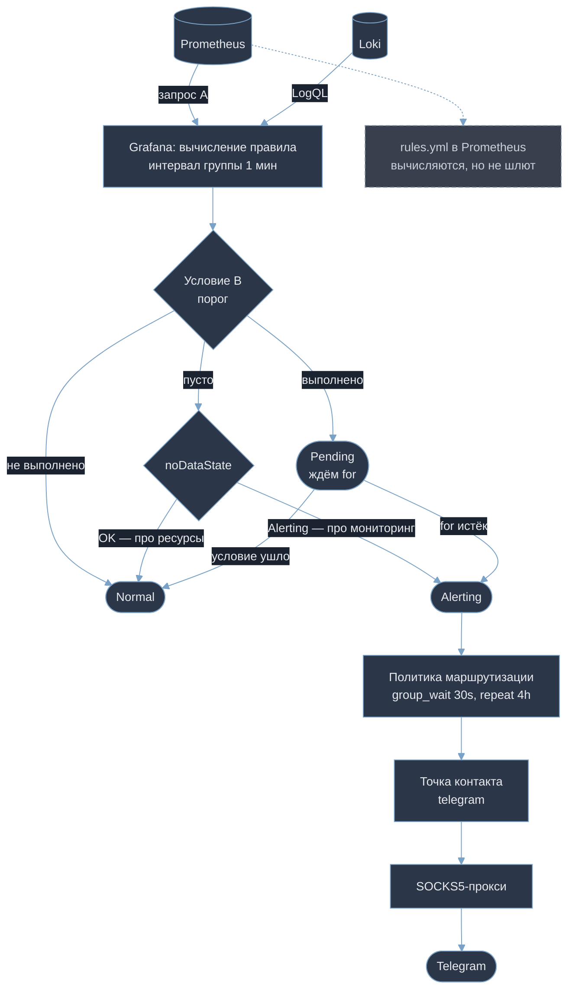
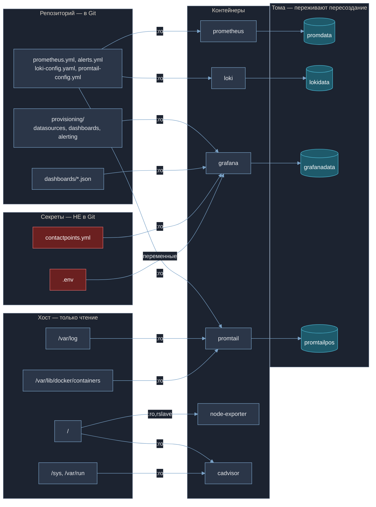

# Стек мониторинга в Docker Compose

Prometheus, Grafana, Loki, promtail, cadvisor и node-exporter в контейнерах. Метрики хоста и контейнеров, системные логи и логи контейнеров в одном интерфейсе, уведомления в Telegram.

Учебный проект с прицелом на эксплуатационную пригодность: тома для данных, конфиги в Git, ограничения ресурсов, проверки готовности, ретенция, работающие оповещения. Всё настраивается файлами — дашборды, источники данных и правила алертов лежат в репозитории, а не в базе Grafana.

> **Ветка `file-logs`.** Логи контейнеров собираются чтением файлов, а не драйвером логирования Loki. Отличия от `main` — в разделе [«Две реализации сбора логов»](#две-реализации-сбора-логов).
> 
> **Есть третья реализация.** В ветке [`tls`](../../tree/tls) nginx с TLS, правило на истечение сертификата, systemd
---

## Состав

|    Сервис     |                  Роль                 |           Порт            |
|---------------|---------------------------------------|---------------------------|
| prometheus    | сбор и хранение метрик                | 9090 (loopback)           |
| node-exporter | метрики хоста                         | 9100 (только внутри сети) |
| cadvisor      | метрики контейнеров из cgroups        | 8080 (только внутри сети) |
| loki          | приём и хранение логов                | 3100 (loopback)           |
| promtail      | сбор логов: `/var/log` и контейнеры   | 9080 (только внутри сети) |
| grafana       | визуализация, алерты, уведомления     | 3000 (loopback)           |

Публикуемые порты слушают только `127.0.0.1` — снаружи виртуалки недоступны, доступ через SSH-туннель.

**Что получается:** 4 дашборда (36 панелей), 16 правил оповещения, ретенция метрик и логов по 7 дней, стек поднимается одной командой без порядка запуска.

---

## Запуск

```bash
cp .env.example .env                    # GRAFANA_PASSWORD, HOSTNAME
chmod 600 .env

cp grafana/provisioning/alerting/contactpoints.example \
   grafana/provisioning/alerting/contactpoints.yml     # токен бота и chat id
chmod 644 grafana/provisioning/alerting/contactpoints.yml

docker compose up -d
docker compose ps
```

Доступ с рабочей машины:

```bash
ssh -L 3000:127.0.0.1:3000 -L 9090:127.0.0.1:9090 <пользователь>@<сервер>
```

Дальше `http://localhost:3000`, логин `admin`, пароль из `.env`.

---

## Потоки данных

Стрелка показывает, **кто инициирует соединение**. Prometheus сам ходит к целям за метриками, поэтому стрелки идут от него.



**Один агент, два источника.** Promtail читает системные логи хоста из `/var/log` и логи всех контейнеров из `/var/lib/docker/containers/*/*-json.log`. Демон Docker пишет их туда сам — плагинов и сетевых зависимостей в цепочке нет.

**Почему не драйвер логирования.** В первой версии stdout контейнеров уходил в Loki напрямую из демона. Это создавало круговую зависимость: приёмник логов жил в том же стеке, что и его источники. Контейнеры не могли завершиться, ожидая записи в недоступный Loki, — не помогал ни `SIGTERM`, ни `SIGKILL`, а в тяжёлых случаях блокировался сам демон Docker.

Файловый сбор эту связь разрывает. Логи попадают на диск независимо от состояния Loki, promtail помнит позиции чтения и после восстановления дочитывает с того места, где остановился. Ничего не теряется, порядок запуска значения не имеет.

---

## Сетевая схема



**Три сервиса не публикуются вовсе** (серым): к ним обращаются только изнутри сети по именам через встроенный DNS Docker `127.0.0.11`.

**Два туннеля в разных направлениях.** Прямой (`ssh -L`) даёт доступ с рабочей машины к интерфейсам. Обратный (`ssh -R`) прокидывает локальный прокси рабочей машины внутрь виртуалки, чтобы Grafana достучалась до Telegram — `api.telegram.org` с сервера заблокирован.

Для `-R` нужна строка `GatewayPorts clientspecified` в `/etc/ssh/sshd_config`: по умолчанию порт привязывается только к loopback сервера, а контейнер туда не дотянется.

**Адреса не зашиты жёстко.** В Grafana используется `host.docker.internal` (через `extra_hosts: host-gateway`), правило ufw задано по диапазону `172.16.0.0/12`. Docker раздаёт подсети по порядку, и при пересоздании сети жёсткий адрес или имя моста молча перестают работать — в логах это видно как `UFW BLOCK ... DPT=10808`.

**Известное ограничение:** туннель живёт, пока открыта SSH-сессия. Закрыл ноутбук — уведомления молча прекратились. Для стенда приемлемо; постоянное решение — клиент прокси на самом сервере с systemd-юнитом либо переход на SMTP.

---

## Алертинг



Алерты ведутся **средствами Grafana**, а не через Alertmanager: для одного сервера с одним экземпляром Prometheus отдельный маршрутизатор избыточен. Всё в `grafana/provisioning/alerting/` — правила, политика, точка контакта.

**16 правил в пяти группах:** место на диске и прогноз заполнения, inode, iowait, память, swap, OOM, нагрузка, расхождение часов, доступность целей, приём метрик и логов, перезапуски контейнеров, приближение к лимиту памяти, всплеск неудачных входов по SSH.

Отдельно стоит отметить `disk-predict-full`: через `predict_linear` он смотрит тренд за шесть часов и предупреждает, что место кончится в ближайшие четыре. Обычный порог «осталось 10%» срабатывает, когда реагировать уже поздно.

**Срабатывание не мгновенное.** После выполнения условия правило переходит в Pending и ждёт `for` — защита от кратковременных всплесков.

**`noDataState` задан осознанно:** у правил про ресурсы `OK` (мерить нечего — молчим, о причине сообщит `target-down`), у правил про доступность мониторинга `Alerting` (нет данных даже по метрике `up` — значит упал Prometheus). Без этого при остановке node-exporter приходили три бесполезных `DatasourceNoData` вместо одного осмысленного.

Правила Prometheus в `prometheus/rules/alerts.yml` вычисляются и видны в интерфейсе, но уведомлений не дают. Оставлены как дублирующая проверка.

---

## Хранение данных



**Конфиги через bind mount с `:ro`** — лежат в Git, версионируются, приложениям нужны только на чтение. **Данные в томах** — их порождают приложения, они же расставляют права.

`docker compose down` безопасен: удаляются контейнеры и сеть, данные остаются. **`docker compose down -v` уничтожает тома** вместе с историей метрик, логами и дашбордами.

**Права на файлы provisioning — 644, а не 600.** Grafana в контейнере работает под UID 472; при 600 файл принадлежит хостовому пользователю, процесс получает `permission denied` и контейнер уходит в цикл перезапусков.

---

## Ограничение роста данных

Диск средствами Docker не ограничивается — `--storage-opt size` не работает с драйвером `overlayfs`. Рост ограничен на уровне приложений.

| Что | Как | Где |
|---|---|---|
| Метрики | `retention.time=7d`, `retention.size=2GB` | `compose.yaml`, секция `command` |
| Логи | `retention_period: 168h` + компактор | `loki/loki-config.yaml` |
| Логи Docker | `max-size: 10m`, `max-file: 3` | `/etc/docker/daemon.json` |

Одной строки `retention_period` недостаточно: Loki сам данные не удаляет, этим занимается компактор, и по умолчанию удаление у него выключено — нужен `retention_enabled: true`.

Сроки у метрик и логов согласованы. Иначе в Grafana метрики за период были бы, а логи уже удалены.

```bash
df -h /
docker system df -v
sudo sh -c 'du -sh /var/lib/docker/volumes/monitoring_*'
```

---

## Про экспортеры, нарушающие изоляцию

**node-exporter** — `pid: host`, корень хоста в `:ro,rslave`, `--path.rootfs=/host`. Без этого отчитывался бы о себе, а не о машине.

**cadvisor** — `privileged: true` и сокет Docker: нужен доступ к cgroups всех контейнеров. Осознанное исключение, более серьёзное, чем у node-exporter.

**Версия cadvisor не ниже 0.55.** Docker использует драйвер хранения `overlayfs`, который держит метаданные слоёв в базе, а не в каталогах `/var/lib/docker/image/<driver>/layerdb/`. Версия 0.49.1 ищет их по старому пути и отдаёт единственную серию с `id="/"` вместо метрик по каждому контейнеру.

---

## Секреты

Пароль Grafana в `.env`, токен бота в `contactpoints.yml`. Оба исключены из Git, рядом лежат шаблоны.

Переменная объявлена обязательной — без `.env` compose откажется запускаться, вместо того чтобы стартовать с паролем по умолчанию:

```yaml
GF_SECURITY_ADMIN_PASSWORD: ${GRAFANA_PASSWORD:?переменная не задана}
```

**Два ограничения.** Пароль виден в `docker inspect -f '{{json .Config.Env}}'` и в `ps` на хосте — для прода существуют `docker secret` и внешние хранилища. И переменная задаёт пароль только при первой инициализации базы; при смене нужен `docker compose exec grafana grafana cli admin reset-admin-password`.

---

## Проверки

```bash
docker compose ps                                    # Up и (healthy)

# шесть целей, все up
curl -s localhost:9090/api/v1/targets | python3 -m json.tool | grep -E '"job"|"health"'

# метрики хоста и контейнеров
curl -sG 'localhost:9090/api/v1/query' --data-urlencode 'query=node_memory_MemAvailable_bytes' | python3 -m json.tool
curl -sG 'localhost:9090/api/v1/query' --data-urlencode 'query=container_memory_usage_bytes{name!=""}' | python3 -m json.tool | grep '"name"'

# логи: должны быть метки job, container_id, stream
curl -s localhost:3100/ready
curl -s 'localhost:3100/loki/api/v1/labels' | python3 -m json.tool
curl -s 'localhost:3100/loki/api/v1/label/job/values' | python3 -m json.tool

# все сервисы на json-file — драйвера Loki больше нет
for c in prometheus grafana node-exporter loki promtail cadvisor; do
  echo -n "$c: "; docker inspect -f '{{.HostConfig.LogConfig.Type}}' monitoring-$c-1
done

# ретенция
curl -s localhost:9090/api/v1/status/flags | python3 -m json.tool | grep retention
curl -s localhost:3100/config | grep -A3 retention_period

# дашборды и правила (пароль спросит, в команду не вставлять)
curl -s -u admin localhost:3000/api/search?query= | python3 -m json.tool | grep '"title"'
curl -s -u admin localhost:3000/api/prometheus/grafana/api/v1/rules | python3 -m json.tool | grep -E '"name"|"health"'

# прокси доступен из контейнера
docker compose exec grafana sh -c 'timeout 5 nc -z host.docker.internal 10808 && echo достижим'
```

Запросы PromQL с фигурными скобками передавать только через `-G --data-urlencode` — иначе оболочка и URL их искажают.

Настоящая проверка алертов — вызвать срабатывание, а не нажать Test:

```bash
docker compose stop node-exporter && sleep 240 && docker compose start node-exporter
```

---

## Резервное копирование

```bash
docker run --rm -v monitoring_grafanadata:/data -v $(pwd):/backup alpine \
  tar czf /backup/grafanadata-$(date +%F).tar.gz -C /data .
```

Восстановление — той же конструкцией с `tar xzf`. Перед снятием копии стек лучше остановить: `docker compose stop`.

Резервирования данных нет: `replication_factor: 1`, хранение в файлах. Потеря тома означает потерю истории.

---

## Документация

| Файл | Что внутри |
|---|---|
| `DEBUG.md` | 18 разобранных случаев диагностики из практики сборки |
| `grafana/dashboards/README.md` | описание всех 36 панелей и запросов |

---

---

## Две реализации сбора логов

| Ветка | Как собираются логи контейнеров | Компромисс |
|---|---|---|
| [`main`](../../tree/main) | драйвер логирования Loki, напрямую из демона | настройка проще, метки приходят готовыми, но круговая зависимость: контейнеры не могут завершиться, пока Loki недоступен |
| `file-logs` | promtail читает `/var/lib/docker/containers/*/*-json.log` | конфиг сложнее — нужен разбор JSON и извлечение ID из пути; зато нет зависимости, логи переживают недоступность Loki |

Вторая версия появилась после трёх залипаний стека при перезапуске: `docker compose restart prometheus` не завершался, `docker compose down` висел 78 секунд с ошибкой, в тяжёлом случае переставал отвечать сам демон.

Файловый сбор — то, как это устроено в Kubernetes: контейнеры пишут в stdout, kubelet складывает в файлы, агент их читает. Драйверов логирования там нет как класса.

**Что изменилось по метками.** В `main` логи контейнеров помечались `compose_project` и `compose_service` — плагин добавлял их сам. Здесь метки другие:

```
{job="containerlogs"}              все контейнеры
{container_id="8e48db3b2152"}      конкретный, короткий ID как в docker ps
{stream="stderr"}                  только ошибки
{job="varlogs"}                    системные логи хоста
```

Сопоставить ID с именем: `docker ps --format '{{.ID}}\t{{.Names}}'`

**Побочный выигрыш:** логи самих Loki и promtail теперь тоже попадают в Grafana. В первой версии оба были исключены из драйвера, и смотреть их можно было только через `docker compose logs`.

## Что можно доработать

- **Прокси на самом сервере** вместо SSH-туннеля — уберёт зависимость от открытой сессии. Либо переход на SMTP.
- **Имена контейнеров вместо ID в метках.** Сейчас `container_id` — короткий хэш. Имя лежит в `config.v2.json` рядом с логом, но promtail его не читает; альтернатива — Docker service discovery, который требует доступа к сокету демона.
- **Reverse proxy с TLS** перед Grafana вместо SSH-туннеля.
- **Вложенные маршруты в политике** — critical в один канал, warning в другой. Метка `severity` у правил уже проставлена.
- **Второй канал доставки** — два независимых пути надёжнее одного.

---

## Структура

```
.
├── compose.yaml
├── .env / .env.example              ← пароли, НЕ в Git
├── .gitignore
├── README.md
├── DEBUG.md
├── prometheus/
│   ├── prometheus.yml
│   └── rules/alerts.yml
├── loki/loki-config.yaml
├── promtail/promtail-config.yml
└── grafana/
    ├── dashboards/
    │   ├── README.md
    │   ├── dashboard-host.json
    │   ├── dashboard-containers.json
    │   ├── dashboard-stack.json
    │   └── dashboard-logs.json
    └── provisioning/
        ├── datasources/datasources.yml
        ├── dashboards/dashboards.yml
        └── alerting/
            ├── rules.yml
            ├── policies.yml
            ├── contactpoints.yml      ← токен, НЕ в Git
            └── contactpoints.example
```